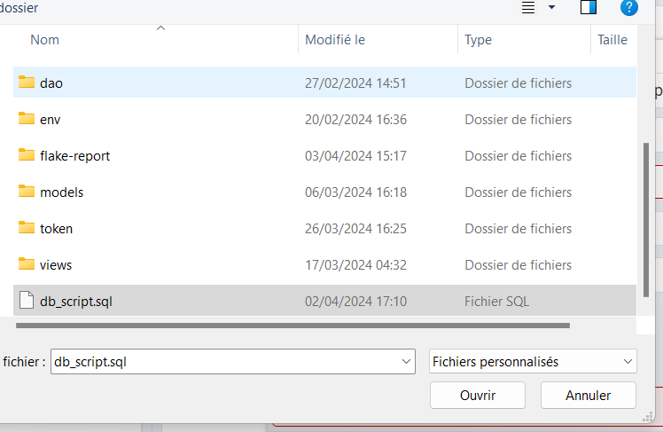

<div align=center>
    
</div>

# Projet 12 DA-Python OC (Fouchal Sami)
***Livrable du Projet 12 du parcours D-A Python d'OpenClassrooms : EPIC EVENT - Développez une architecture back-end sécurisée avec Python et SQL***

_Testé sous Windows 11 - Python version 3.11.4_

## Objectif
L'objectif est de développer une solution CRM sécurisée interne à l'entreprise Epic Events.
Epic Events est une entreprise qui organise des événements pour ses clients.


## Fonctionnalités
L'idée est de pouvoir collecter et traiter les données des clients et des évènements que l'entreprise
organise pour eux à travers une base de données, tout en facilitant la communication entre les
différents départments de l'entreprise.

La gestion est assurée par 3 départements:

● le département commercial.

● le département support.

● le département gestion.

Les commerciaux démarchent les clients. Ils créent et mettent à jour leurs profils sur la plateforme. Lorsqu’un client souhaite organiser un événement, un collaborateur du département gestion crée un contrat et l’associe au client.

Une fois le contrat signé, le commercial crée l’événement dans la plateforme et le département gestion désigne un membre du département support qui sera responsable de l’organisation et du déroulé de l’événement.

## Technologies utilisées

<div>

<ul>
    <li>Python</li>
    <li>Postgresql</li>
    <li>Sqlalchemy</li>
    <li>Sentry</li>
</ul>
</div>

## Initialisation du projet

### Windows :
Dans Windows Powershell, naviguer vers le dossier souhaité.
###### • Récupération du projet
```
git clone https://github.com/Gaiden92/P12OC.git
```

###### • Créer et activer un environnement virtuel

```

python -m venv env 
env\Scripts\activate
```

###### • Installer les paquets requis

```
pip install -r requirements.txt

```

### MacOS et Linux :
Dans le terminal, naviguer vers le dossier souhaité.
###### • Récupération du projet
```
git clone https://github.com/Gaiden92/P12OC.git
```

###### • Créer et activer un environnement virtuel
```
python3 -m venv env 
source env/bin/activate
```

###### • Installer les paquets requis
```
pip install -r requirements.txt

```

###### • Installer PostgreSql et PGAdmin
<p>Liens :</p> 

<a href='https://www.postgresql.org/download/' title="postgresql">Postgresql</a>

<br>

<a href='https://www.pgadmin.org/download/' title="Pgadmin">PGAdmin</a>


Une fois connecté à PGadmin, sélectionner la base de donnée souhaité (par défault postgres) et effectuer un clique droit dessus puis cliquez sur "Restore".


Dans la rubrique "filename", cliquez sur le dossier et allez chercher le fichier "db_script.sql" du projet.




Une fois le process terminé, clique droit sur la base de donnée et "Refresh"


ATTENTION: Vous devrez modifier le fichier "config/parameters.py" en fonction de vos données :
- nom de la base (si vous en avez créer une nouvelle)
- votre mot de passe d'administrateur
- le port utilisé
- le localhost
...
Ne modifier pas les autres données sous peines de provoquer des erreurs dans l'application.

## Utilisation

- Pour se connecter l'utilisateur utilise la commande suivante:
```
python main.py user-commands login
```
- L'utilisateur recevra un token et devra le fournir pour chaque action (prenez soin de le noter).
Le token a une durée de vie de 30 minutes mais vous pouvez la modifier dans le fichier cité plus haut.
A noter que la durée est en minute.

- La liste des fonctions disponibles peut être visualisée en utilisant simplement les commandes suivantes:
```
python main.py : commandes principales
python main.py collaborator-commands : commandes relatives à la gestion des employés
python main.py company-commands : commandes relatives à la gestion des entreprises
python main.py department-commands : commandes relatives à la gestion des departments
python main.py client-commands : commandes relatives à la gestion des clients
python main.py contract-commands relatives à la gestion des contrats
python main.py event-commands relatives à la gestion des évènements
```
